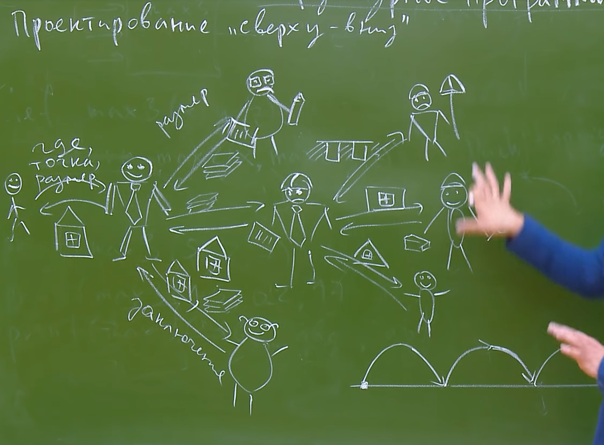

#Структурное программирование

##Парадигма: Проектирование сверху вниз

###Разработка программного продукта должна происходить итеративно.

Разработка программного продукта происходит сверху вниз:

- Изначально описывается главный функционал. На данном уровне конкретизируются только те входные параметры, которые понадобятся для получения окончательного результата. На данном этапе разработки *нас не интересует, каким образом будут реализованы манипуляции* над исходными данными - нас интересует только то, что мы должны получить по итогу. **Формальным языком: мы конкретизируем интерфейс взаимодействия с функцией и создаём *mock*-функцию (функцию-пустышку)**
- На следующем этапе конкретизируется, какие функции будут вызываться в теле основной функции. **Мы переходим от функций верхнего уровня к функциям более нижних уровней, конкретизируя взаимодействия.** *Более обширные высокоуровневые задачи при этом разбиваются на более малые.*
    
Программа должна иметь периодические точки пересечения с таймлайном проекта. Это значит, что на каждой итерации программа проходит два этапа:

1. Этап взлёта (мечтания о функциях)
    * На данном этапе разработчик приводит программу в неконсистентное состояние (т.е. программа не будет работать нормально - она будет выдавать ошибки в процессе выполнения)
    * Здесь происходит основной творческий процесс, когда разработчик разбивает основную задачу на более низкоуровневые компоненты. При этом, данные компоненты представляют собой лишь наброски того, что предстоит сделать отдельным компонентам кода
    * Мы понимаем, что должны будут делать функции более низкого уровня, однако, мы отмечаем это на уровне названия данных функций - **её имя должно в полной мере отражать её назначение**

2. Этап приземления
    * На данном этапе функция приводится обратно к консистентному состоянию.

В конце каждой итерации данного цикла разработки я как разработчик чётко понимаю, что представляет из себя программа и каково её назначение. 

